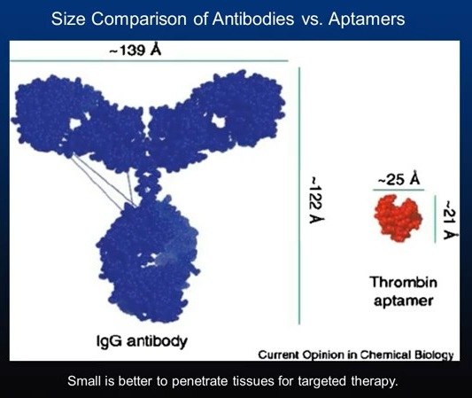

# Synthetic Antibodies for treating COVID19

## Introduction

While antibodies have been widely applied in both biology and clinical medicine, the application of aptamers -- nucleic acid recognition molecules -- possess several advantageous traits for the research and treatment of SARS-CoV-2. The smaller size of aptamers (about 2-3 nm in diameter), as compared to antibodies (about 12-15 nm in diameter), subject them to less steric hindrance on the surface of coronavirus (about 100 nm in diameter). In theory, the smaller size allows for the binding of more recognition molecules on the same surface area of coronavirus. Due to the chemical nature of nucleic acid, aptamers can be chemically synthesized, precisely modified, high thermally stable, and possess little batch-to-batch variation. These traits make for convenient transportation, storage, and standardization. Additionally, aptamers can be combined with other technologies to expand their performance and applications.

# Videos

## Glossary of Terms

<dl>
  <dt>[receptor binding domain (RBD)](https://en.wikipedia.org/wiki/Binding_domain)</dt>
  <dd>The part of a molecule that binds to a receptor (eg: SARS-CoV-2's spikes have an RBD which binds to the ACE2 receptor)</dd>

  <dt>ΔG</dt>
  <dd>The binding free energy of the RBDs and the human ACE2 (lower ΔG means higher affinity)</dd>

  <dt>KD</dt>
  <dd>Equilibrium dissociation constant in µM (lower value means higher affinity)</dd>
</dl>

## Research

* [Discovery of Aptamers Targeting Receptor-Binding Domain of the SARS-CoV-2 Spike Glycoprotein (ChemRxiv, 2020-02-04)](Discovery of Aptamers Targeting Receptor-Binding Domain of the SARS-CoV-2 Spike Glycoprotein (ChemRxiv, 2020-04-04).pdf)
> The World Health Organization has declared the outbreak of a novel coronavirus (SARS-CoV-2 or 2019-nCoV) as a global pandemic. However, the mechanisms behind the coronavirus infection are not yet fully understood, nor are there any targeted treatments or vaccines. In this study, we identified high-binding-affinity aptamers targeting SARS-CoV-2 RBD, using an ACE2 competition-based aptamer selection strategy and a machine learning screening algorithm. The K d values of the optimized CoV2-RBD-1C and CoV2-RBD-4C aptamers against RBD were 5.8 nM and 19.9 nM, respectively. Simulated interaction modeling, along with competitive with experiments, suggests that two aptamers may have partially identical binding sites at ACE2 on SARS-CoV-2 RBD. These aptamers present an opportunity for generating new probes for recognition of SARS-CoV-2, and could provide assistance in the diagnosis and treatment of SARS-CoV-2 while providing a new tool for in-depth study of the mechanisms behind the coronavirus infection.

* [SARS-CoV-2 RBD-4C (ID# 7060) sequence](https://www.aptagen.com/aptamer-details/?id=7060)
> The DNA sequence of an aptamer which binds to the receptor binding domain of SARS-CoV-2's spikes

* [ssDNA aptamers against the SARS-CoV-2 spike protein delivered through inhalation (Clarkson, 2020)](pdfs/ssDNA aptamers against the SARS-CoV-2 spike protein delivered through inhalation (Clarkson, 2020)
.pdf)
> Proposed is a therapeutic method based on single-stranded DNA aptamers targeted against the specific sequence (the RBD motif) of Spike protein responsible for SARS-CoV2 entry into human epithelial cells. Solubilized and packed in extremely cheap, pressurized metered-dosed inhalers (pMDI), the selectively chosen aptamer(s) can be quickly and effectively inhaled in the upper respiratory tree in the form of aerosolized particles covering the epithelial surface and blocking the SARS-CoV2 entry into the cells, thus inhibiting its replication.

* [Applications of aptamers in detection and therapeutics of SARS-CoV](https://www.aptamergroup.co.uk/applications-of-aptamers-in-detection-and-therapeutics-of-sars-cov/)
> [The Aptamer Group](https://aptamergroup.co.uk) is currently [requesting partners](AptamerGroup COVID-19 test, request for partners (2020-03-31).pdf) to manufacture tests.
> 
> 

* [Oligonucleotides and the COVID-19 Pandemic, A Perspective (Nature, 2020-04-04)](Oligonucleotides and the COVID-19 Pandemic, A Perspective (Nature, 2020-04-04).pdf)
> With few safe and effective drugs available to combat this threat to humanity and the normal functioning of our society, the oligonucleotide research community is uniquely positioned to apply its technology and expertise to help alleviate the crisis, thanks to its capacity for rational drug design, swift development cycles, and pursuing targets undruggable by conventional treatment strategies.

* [Review of Recent Advances in Aptamer Discovery and Applications (molecules, 2019-01-25)](Review of Recent Advances in Aptamer Discovery and Applications (molecules, 2019-01-25).pdf)
> Aptamers are short, single-stranded DNA, RNA, or synthetic XNA molecules that can be developed with high affinity and specificity to interact with any desired targets. They have been widely used in facilitating discoveries in basic research, ensuring food safety and monitoring the environment. Furthermore, aptamers play promising roles as clinical diagnostics and therapeutic agents. This review provides update on the recent advances in this rapidly progressing field of research with particular emphasis on generation of aptamers and their applications in biosensing, biotechnology and medicine. The limitations and future directions of aptamers in target specific delivery and real-time detection are also discussed.

* [Differential Inhibitory Activities and Stabilisation of DNA Aptamers against the SARS-CoV-1 Helicase (ChemBioChem, 2008-07-18)](Differential Inhibitory Activities and Stabilisation of DNA Aptamers against the SARS-CoV-1 Helicase (ChemBioChem, 2008-07-18).pdf)
> The helicase from SARS-CoV possesses NTPase, duplex RNA/DNA-unwinding and RNA-capping activities that are essential for viral replication and proliferation. Here, we have isolated DNA aptamers against the SARS-CoV helicase from a combinatorial DNA library. These aptamers show two distinct classes of secondary structure, G-quadruplex and non-G-quadruplex, as shown by circular dichroism and gel electrophoresis. All of the aptamers that were selected stimulated ATPase activity of the SARS-CoV helicase with low- nanomolar apparent K m values. Intriguingly, only the non-G-quadruplex aptamers showed specific inhibition of helicase activi- ties, whereas the G-quadruplex aptamers did not inhibit helicase activities. The non-G-quadruplex aptamer with the strongest inhibitory potency was modified at the 3’-end with biotin or inverted thymidine, and the modification increased its stability in serum, particularly for the inverted thymidine modification. Structural diversity in selection coupled to post-selection stabilisation has provided new insights into the aptamers that were selected for a helicase target. These aptamers are being further developed to inhibit SARS-CoV replication.

* [Structural basis of receptor recognition by SARS-CoV-2 (Nature, 2020-02-16)](Structural basis of receptor recognition by SARS-CoV-2 (Nature, 2020-02-16).pdf)
> SARS-CoV-2 and SARS-CoV bind with the angiotensin-converting enzyme 2 (ACE2) receptor in humans. SARS-CoV-2's RBD has a more compact conformation than the SARS-CoV RBD. Several residue changes in the SARS-CoV-2 RBD stabilize two virus-binding hotspots at the RBD–ACE2 interface which increase its ACE2-binding affinity. The RaTG13 bat coronavirus, which is closely related to SARS-CoV-2, also uses human ACE2 as its receptor. The differences among SARS-CoV-2, SARS-CoV and RaTG13 in ACE2 recognition shed light on the potential animal-to-human transmission of SARS-CoV-2.

## Outline

* aptamers are the next-generation of disease detection and treatment
  * it costs pennies to manufacture aptamers, and dollars for antibodies
  * faster to design and produce
  * more stable than antibodies -> long shelf-life (snaps back into shape after being heated/denatured, while antibodies get torn apart)
  * 1/5 the size of an antibody<1> (can penetrate tissues more easily)
  * extremely precise (10000x greater specificity than antibodies, meaning low cross-reactivity and false-positives)
  * can sense *and* treat diseases
  * immune response is instant (compared to vaccines which take days to weeks for the body to recognize the pathogen)
  * SARS-CoV-2 treatments exist now
  * can map out unknown biomarkers in samples (eg: by giving positive and negative patient samples)
  * large existing database of aptamer sequences for known targets
* how the immune system works
  * t-cells (recognizers), white blood cells, phagocytes, lymphocytes (clean-up)
* how aptamers work
  * like a mini-tcell
  * can be built with an adapter on one side which the immune-cleanup-crew can recognize
    * alpha-gal epitope is a molecule that our immune system always recognizes
    * we can't get rid of it, why not use it for something?

* to clean up a virus, the body needs to create little molecules (antibodies) that stick to the virus. the virus is now unable to attack any cells, since it's covered in these little antibodies. the body then sends out cells which eat anything covered in antibodies (the antibodies can be recognized by the cleaners).
* the antibodies are created randomly, then put through a gruelling series of tests before being allowed into the body. the tests make sure the antibody can recognize invaders, but won't recognize your own cells (when the antibodies recognize your own cells, it's called an autoimmune disease, and it's very dangerous, because the cleaners start eating your own tissues).
